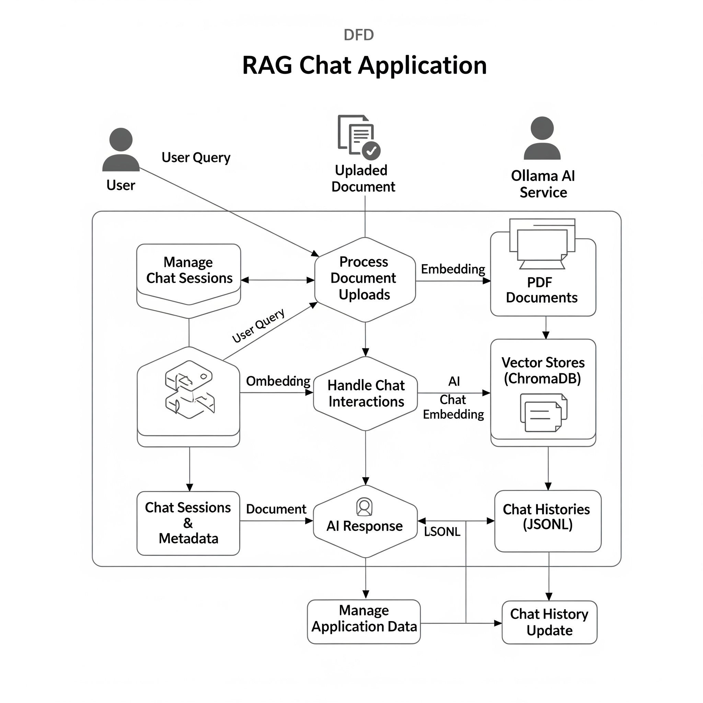
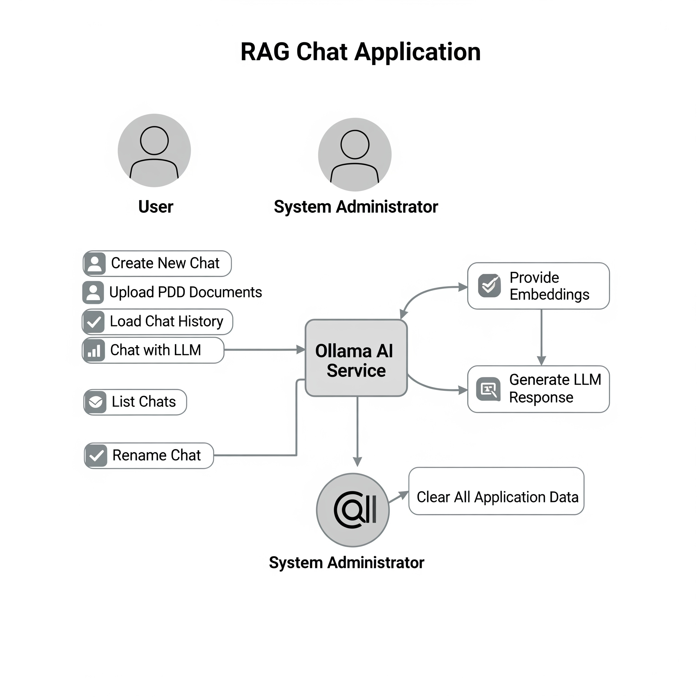
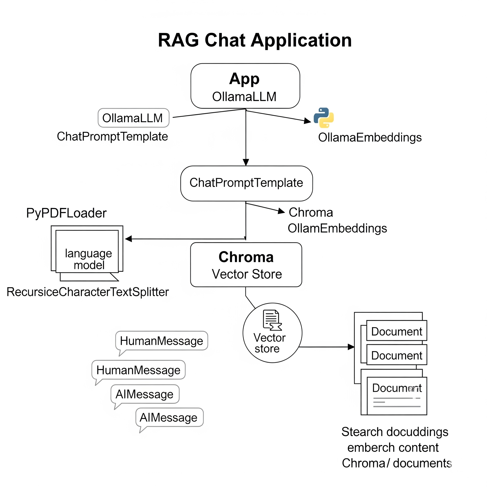

# RAG Chat Application with Dynamic Document Context and Persistent History

## Table of Contents
1.  [Introduction](#introduction)
2.  [Features](#features)
3.  [How it Works](#how-it-works)
4.  [Prerequisites](#prerequisites)
5.  [Installation](#installation)
    * [Backend (Python)](#backend-python)
    * [Frontend (React)](#frontend-react)
    * [Ollama Models](#ollama-models)
6.  [Running the Application](#running-the-application)
    * [Start Backend](#start-backend)
    * [Start Frontend](#start-frontend)
7.  [Usage](#usage)
8.  [Project Structure](#project-structure)
9.  [UML and DFD Diagrams](#uml-and-dfd-diagrams)
10. [License](#license)

## 1. Introduction
This project is a Retrieval-Augmented Generation (RAG) chat application that allows users to upload custom PDF documents, query them using a Large Language Model (LLM), and maintain persistent conversation history for each chat session. The application features a Flask backend for API services and a React frontend for an interactive user interface.

## 2. Features
* **Dynamic Chat Sessions:** Create new chat sessions, each with its own isolated document context and conversation history.
* **Persistent Chat Naming:** Rename chat sessions from the UI, with changes reflected in the underlying file system (directory names).
* **PDF Document Uploads:** Upload multiple PDF files per chat session for RAG context.
* **Conversation History:** Chat history is saved and loaded automatically for each session, allowing users to continue past conversations.
* **Contextual AI Responses:** LLM answers are grounded in the content of the uploaded documents.
* **Customizable LLM Prompt:** The prompt template encourages detailed, comprehensive, and well-structured responses, with a default length target.
* **Ollama Integration:** Uses Ollama for local LLM (Llama 3.2) and embedding (mxbai-embed-large) models.
* **Cross-Origin Resource Sharing (CORS):** Secure communication between frontend and backend.

## 3. How it Works
The application follows a client-server architecture:

* **React Frontend:**
    * Provides the graphical user interface for users to interact with the application.
    * Manages the display of chat lists, conversation history, and forms for input (creating chats, uploading documents, sending messages, renaming chats).
    * Communicates with the Flask backend via RESTful API calls to fetch and send data.

* **Flask Backend:**
    * Acts as the API server, exposing endpoints for all application functionalities.
    * Manages **chat sessions**, associating each chat with a unique directory on the file system.
    * **Document Processing:** When PDFs are uploaded, they are loaded, chunked using `RecursiveCharacterTextSplitter`, and their embeddings are stored in a dedicated **ChromaDB instance** for that specific chat.
    * **Conversation History Persistence:** Chat messages (user queries and AI responses) are saved to individual `.jsonl` files within a `chat_histories` directory, ensuring history persists across server restarts.
    * **RAG (Retrieval-Augmented Generation):**
        1.  When a user asks a question, the backend retrieves the most relevant document chunks from the chat's ChromaDB instance.
        2.  These retrieved chunks, along with the current conversation history and the user's question, are combined into a comprehensive prompt.
        3.  The prompt is sent to the Ollama LLM for generating a coherent and contextually relevant answer.
    * **File System Management:** Directly manages directories (`chroma_db/`, `uploaded_pdfs/`, `chat_histories/`) for each chat to store vector databases, raw PDF files, and conversation history, respectively.

* **Ollama AI Service:**
    * Runs as a separate local service.
    * Provides the `mxbai-embed-large` model for generating embeddings (vector representations of text).
    * Provides the `llama3.2` model for generating human-like responses based on the RAG prompt.

## 4. Prerequisites
Before you begin, ensure you have the following installed:

* **Python 3.8+**
* **Node.js (LTS version recommended)** and **npm** (Node Package Manager)
* **Ollama:** Download and install Ollama from [ollama.com](https://ollama.com/).

## 5. Installation

### Backend (Python)

1.  **Clone the repository** (or ensure you have all your project files).
2.  **Navigate to your backend project directory** (where `app.py` and `requirements.txt` are located).
3.  **Create a Python virtual environment** (recommended):
    ```bash
    python -m venv venv
    ```
4.  **Activate the virtual environment**:
    * On Windows:
        ```bash
        .\venv\Scripts\activate
        ```
    * On macOS/Linux:
        ```bash
        source venv/bin/activate
        ```
5.  **Install Python dependencies**:
    Create a `requirements.txt` file with the following content:
    ```
    Flask
    Flask-CORS
    langchain
    langchain-ollama
    langchain-chroma
    langchain-community
    pandas
    pypdf
    jsonlines
    ```
    Then install them:
    ```bash
    pip install -r requirements.txt
    ```

### Frontend (React)

1.  **Navigate to the directory where you want to create your React app** (e.g., in the same parent directory as your Flask project).
2.  **Create a new React project**:
    ```bash
    npx create-react-app book-summarizer
    ```
3.  **Navigate into your new React project directory**:
    ```bash
    cd book-summarizer
    ```
4.  **Replace the contents of `book-summarizer/src/App.js` with the provided `App.js` code.**
5.  **Create a `components` folder inside `book-summarizer/src/`**.
6.  **Create `book-summarizer/src/components/ChatList.js` and `book-summarizer/src/components/ChatList.css` with the provided code.**
7.  **Create `book-summarizer/src/components/CreateChat.js` with the provided code.**
8.  **Create `book-summarizer/src/components/ChatWindow.js` and `book-summarizer/src/components/ChatWindow.css` with the provided code.**
9.  **Ensure your `book-summarizer/src/App.css` file contains the base styles provided.**

### Ollama Models

1.  **Ensure Ollama is running** on your system.
2.  **Pull the required models**:
    ```bash
    ollama pull llama3.2
    ollama pull mxbai-embed-large
    ```

## 6. Running the Application

You will need to run the backend and frontend simultaneously in separate terminals.

### Start Backend

1.  Open your terminal and navigate to your **backend project directory**.
2.  Activate your virtual environment (if not already active).
3.  Run the Flask application:
    ```bash
    python app.py
    ```
    The backend will start, typically on `http://127.0.0.1:5000/`.

### Start Frontend

1.  Open a **new terminal** and navigate to your **React project directory** (`book-frontend`).
2.  Start the React development server:
    ```bash
    npm start
    ```
    The frontend will open in your browser, typically on `http://localhost:3000/`.

## 7. Usage

1.  **Access the application** in your web browser at `http://localhost:3000/`.
2.  **Create a new chat:**
    * Enter an optional name in the input field and click "Create Chat" to give your session a friendly name (e.g., "MyResumeDocs").
    * Leave the field blank and click "Create Chat" to generate a unique ID (UUID) for the session.
3.  **Select a chat:** Click on any listed chat name/ID in the left panel to load its context and history into the main chat window.
4.  **Upload Documents:** In the "Upload PDFs for this Chat" section, select one or more PDF files and observe the indexing process.
5.  **Chat with the AI:** Type your questions in the input area and send them. The AI will respond based on the uploaded documents and the ongoing conversation history.
6.  **Rename Chat:** In the "Rename this Chat" section, enter a new name for the currently selected chat and click "Rename Chat". The chat name (and its corresponding directories on disk) will be updated, and the UI will reflect the change.

## 8. UML and DFD Diagrams
The architecture and data flow of this application are described by the following diagrams:

* **Data Flow Diagram (DFD):**
    

* **Use Case Diagram:**
    

* **UML Class Diagram:**
    